<div id="top"></div>

<br />
<div align="center">
  
<h3 align="center">Stockverse</h3>

  <p align="center">
    Stock market investments are trending forms of investment in the current society. People can multiply their profits by just knowing how and where to invest in stocks with the right information. This document details an application based on stock market investment business that includes all features that will be easily accessible to the users. It also includes actions performed by the admin who is responsible for the site management and providing information to the users who need it. The application is built using ReactJS, NodeJS and mongo DB.
  </p>
</div>


<!-- TABLE OF CONTENTS -->
<details>
  <summary>Table of Contents</summary>
  <ol>
    <li>
      <a href="#about-the-project">About The Project</a>
      <ul>
	<li><a href="#architecture-and-sitemap">Architecture and Sitemap</a></li>
	<li><a href="#features">Features</a></li>
        <li><a href="#built-with">Built With</a></li>
      </ul>
    </li>
    <li>
      <a href="#getting-started">Getting Started</a>
      <ul>
        <li><a href="#installation">Installation</a></li>
      </ul>
    </li>
    <li><a href="#contact">Contact</a></li>
  </ol>
</details>


<!-- ABOUT THE PROJECT -->
## About The Project

Stockverse is a wealth-building application that shares information about publicly traded companies. Today, with the advent of urbanization and access to the internet, there are many applications built on the same concept as wealth simple, BMO investors etc. This website offers various benefits and helps in investing better.
	
The URL of the deployed Frontend application: http://stockverse-front-end.herokuapp.com/
The URL of the deployed Backend application: https://stockverse-back-end.herokuapp.com/

### Architecture and Sitemap

<p align="center">
    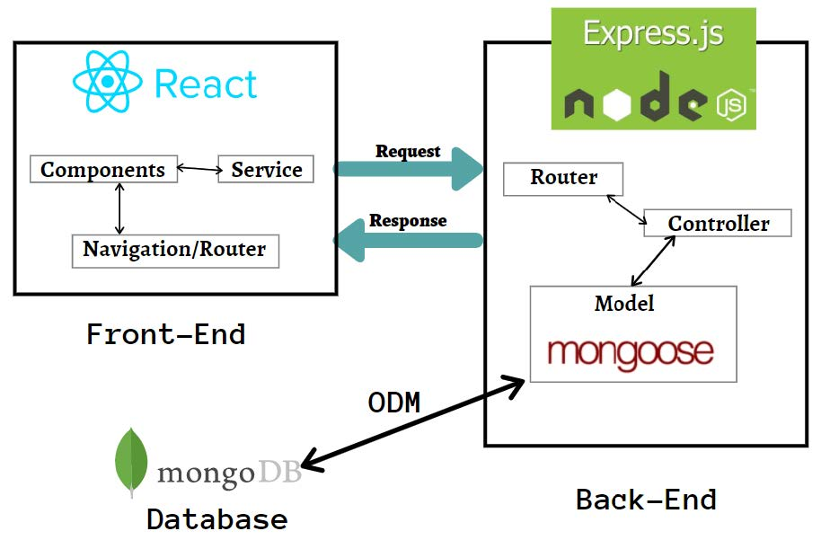 
</p>
<br />
<p align="center">
    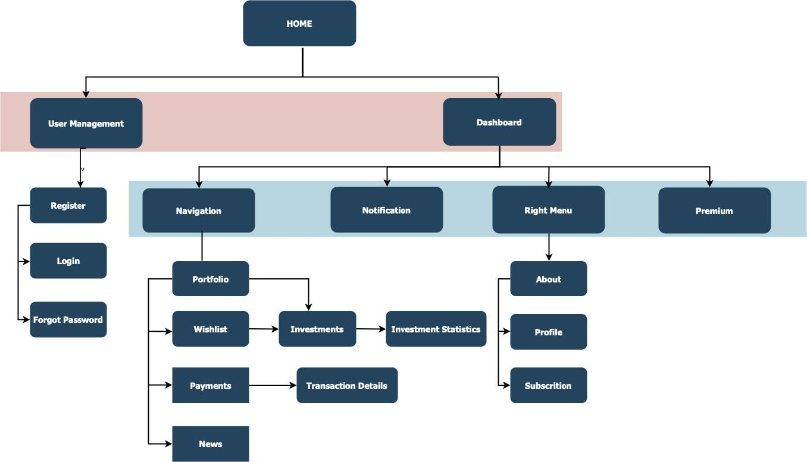 
</p>

### Features

<p align="center">
	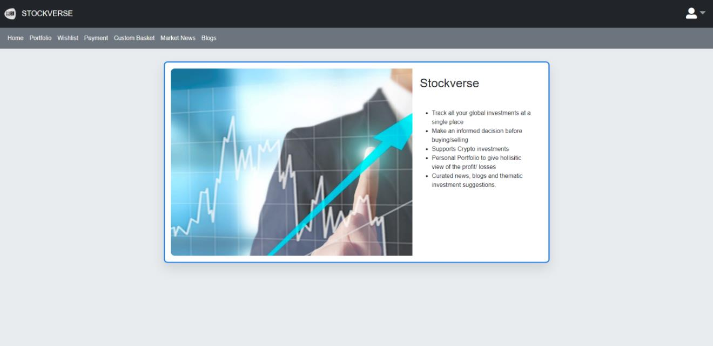 
</p>
<br />

* User Management Feature
	<p align="center">
		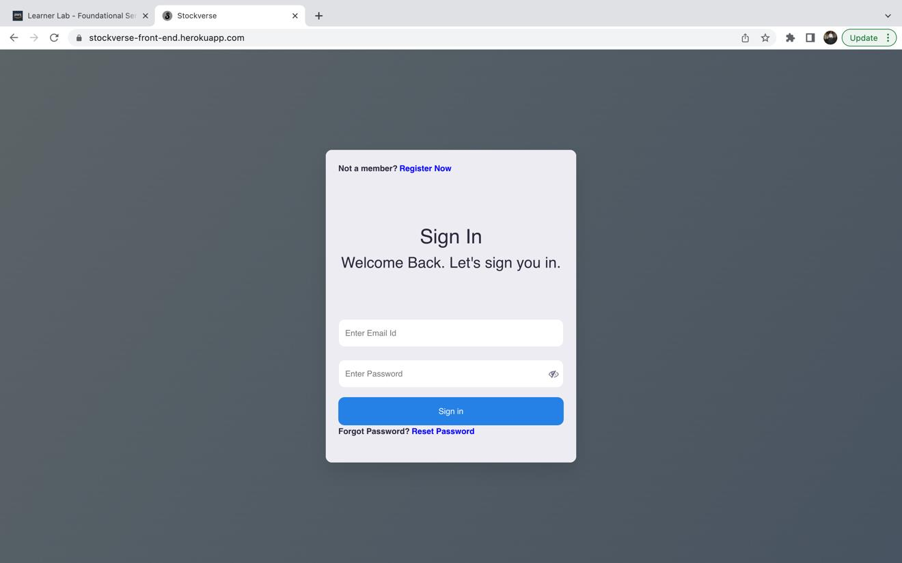 
	</p>
	<br />
	<p align="center">
		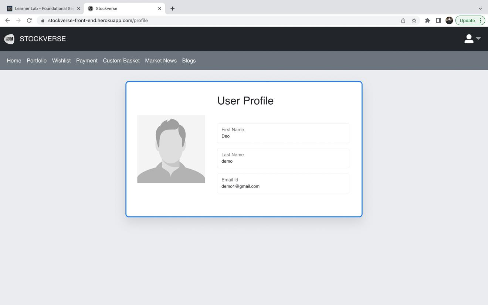 
	</p>
	<br />
* Portfolio Feature
	<p align="center">
		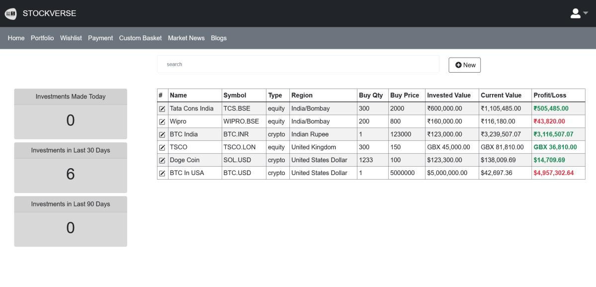 
	</p>
	<br />
* Wishlist Feature
	<p align="center">
		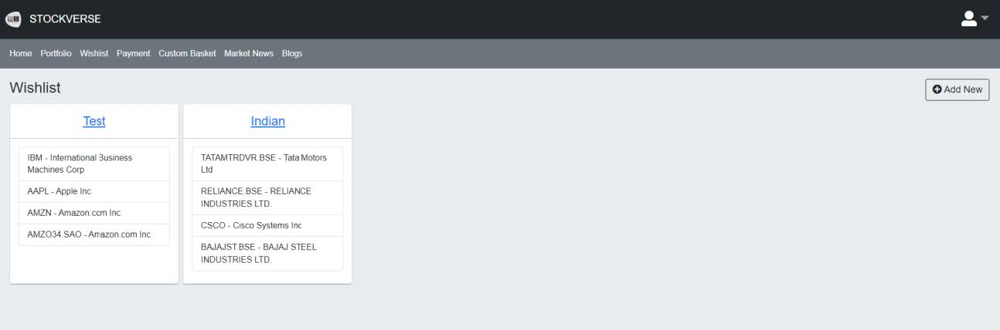 
	</p>
	<br />
	<p align="center">
		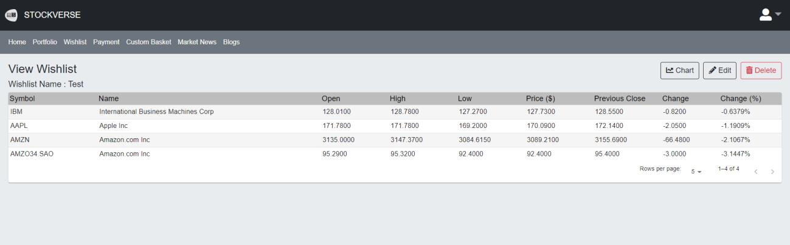 
	</p>
	<br />
* Instrument Dashboard Feature
	<p align="center">
		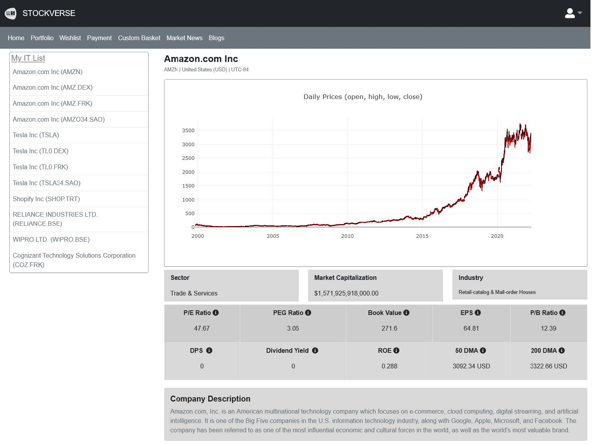 
	</p>
	<br />
* Custom Basket (User & Admin) Feature
	<p align="center">
		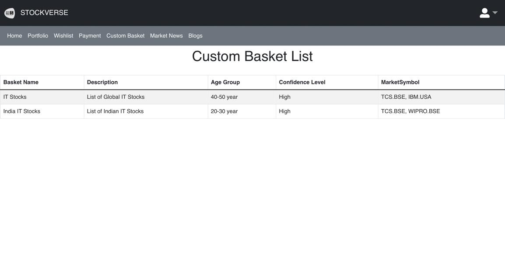 
	</p>
	<br />
* Market News Feature
	<p align="center">
		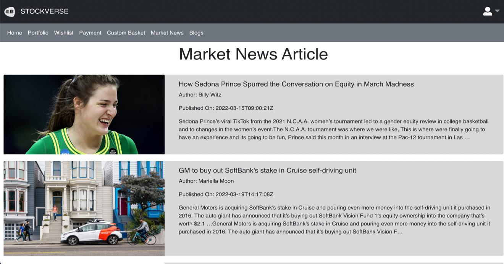 
	</p>
	<br />
* Blog management Feature
	<p align="center">
		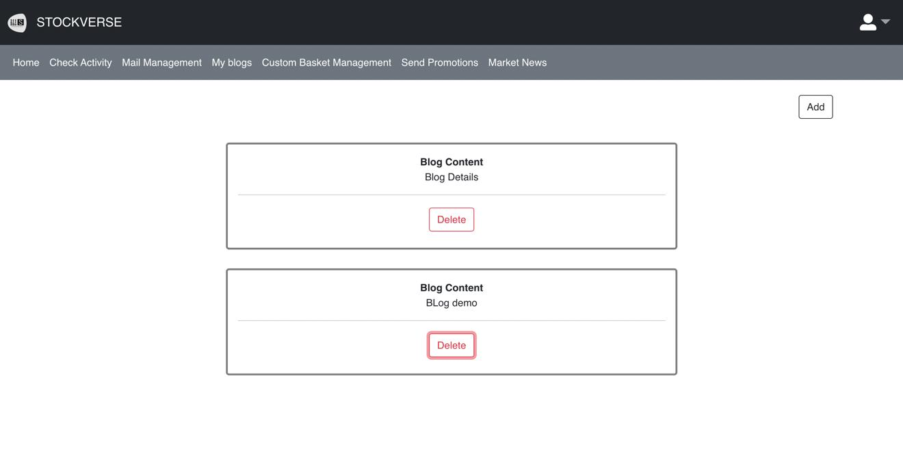 
	</p>
	<br />
* Payment Feature
	<p align="center">
		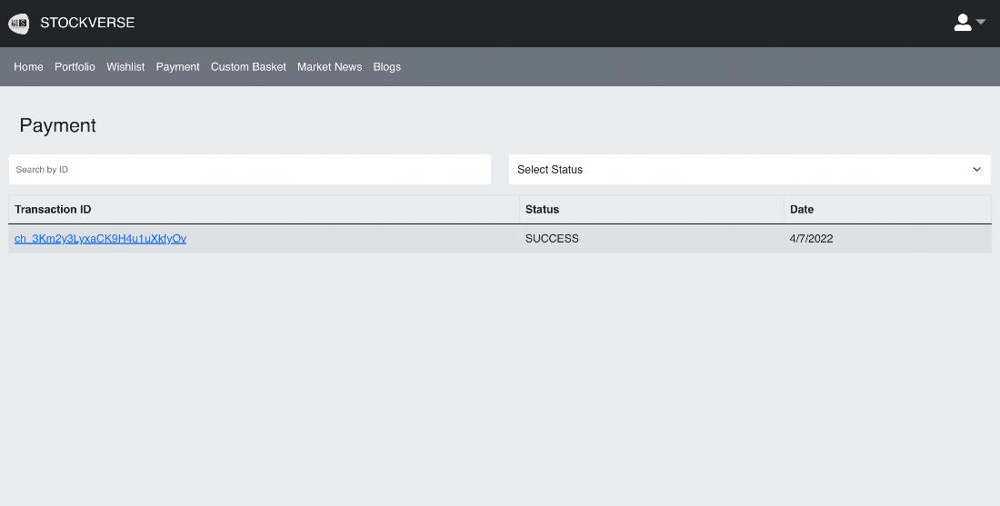 
	</p>
	<br />
	<p align="center">
		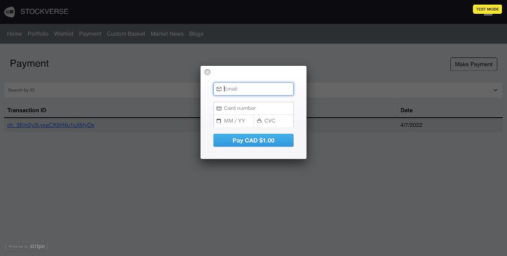 
	</p>
	<br />
* Mail Management/Send Promotions Feature
	<p align="center">
		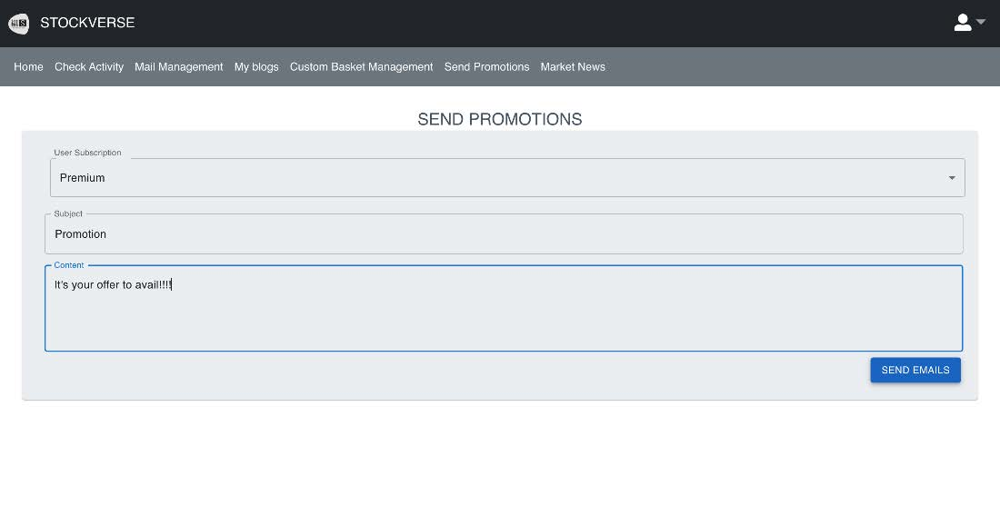 
	</p>
	<br />
	<p align="center">
		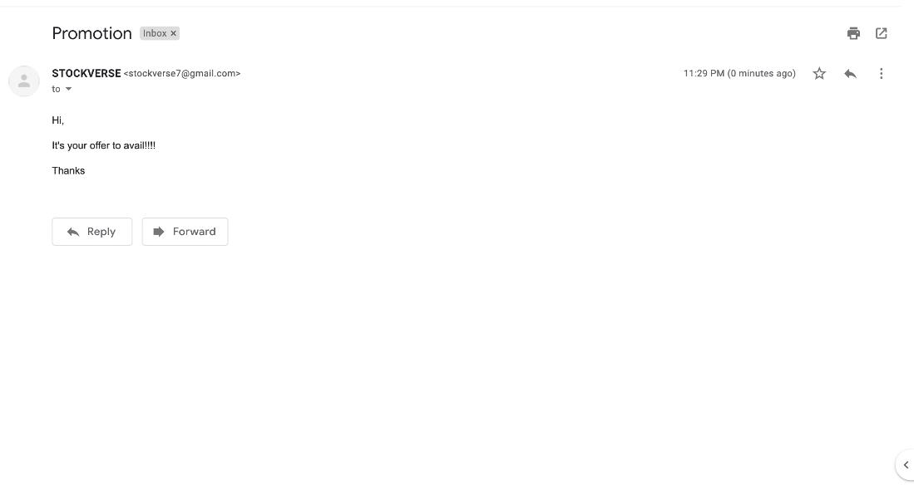 
	</p>
	<br />
* Admin Dashboard
* User Statistics


### Built With

(MERN)
* [MongoDB](https://www.mongodb.com/)
* [ExpressJS](https://expressjs.com/)
* [ReactJS](https://reactjs.org/)
* [NodeJS](https://nodejs.org/)
* [NPM](https://docs.npmjs.com/downloading-and-installing-node-js-and-npm)
* [HerokuCLI](https://devcenter.heroku.com/articles/heroku-cli)
* [Axios](https://axios-http.com/docs/intro)
* [React Bootstrap](https://remotestack.io/react-bootstrap-login-register-ui-templates/)
* [Material-UI](https://mui.com/)
* [Font Awesome 5](https://www.w3schools.com/icons/fontawesome5_intro.asp)

<p align="right">(<a href="#top">back to top</a>)</p>


<!-- GETTING STARTED -->
## Getting Started

### Installation

1. Clone the repo
   ```sh
   git clone https://github.com/Patel-Parthkumar/Stockverse.git
   ```
2. Change directory to the folder
   ```sh
   cd Backend
   ```
3. Install NPM packages
   ```sh
   npm install
   ```
3. Enter your keys in .env
4. Run the command npm run server to start Node.js + Express server, Server will start at localhost:5000
5. Change directory to the folder
   ```sh
   cd Frontend
   ```
6. Install NPM packages
   ```sh
   npm install
   ```
7. Enter your keys in .env
8. Run the command npm index.js to start React.js and Enjoy
   
<p align="right">(<a href="#top">back to top</a>)</p>


<!-- CONTACT -->
## Contact

Contributors Names

* Parthkumar Patel
* Amandeep Singh Matta
* Monisha J
* Pallavi Cherukupalli
* Sai Rahul Kodumuru
* Shiv Gaurang Desai

<p align="right">(<a href="#top">back to top</a>)</p>

